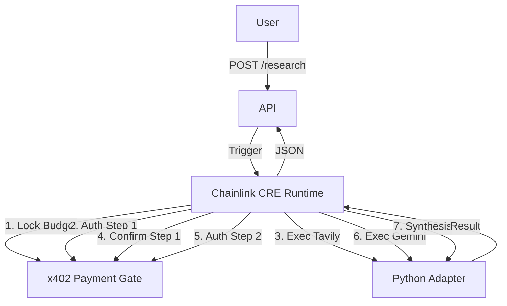

# Pay-Per-Thought Agent

**Autonomous research agent with x402 micropayment enforcement.**  
Every reasoning step is metered, authorized on-chain, and cryptographically verifiable.

Built for the [Chainlink CRE Hackathon](https://chain.link/hackathon)

---

## Chainlink Usage

- CRE workflow: [workflows/pay_per_thought/workflow.yaml](https://github.com/phessophissy/pay-per-thought-agent/blob/main/workflows/pay_per_thought/workflow.yaml)
- Runner script: [scripts/run_real_workflow.py](https://github.com/phessophissy/pay-per-thought-agent/blob/main/scripts/run_real_workflow.py)
- Contracts: [contracts/](https://github.com/phessophissy/pay-per-thought-agent/tree/main/contracts)

---

## Architecture

```
┌─────────────────────────────────────────────────────────────────┐
│                    FastAPI Server (:8000)                        │
│                                                                 │
│  POST /research  ─────────────────────────────────────────────  │
│       │                                                         │
│       ▼                                                         │
│  ┌──────────┐    ┌───────────────┐    ┌──────────────┐          │
│  │ PLANNING │───▶│   EXECUTION   │───▶│  SYNTHESIS   │          │
│  │          │    │               │    │              │          │
│  │ Gemini   │    │ For each step:│    │ Gemini       │          │
│  │ decompose│    │  1. x402 auth │    │ aggregate    │          │
│  │ query    │    │  2. tool call │    │ evidence     │          │
│  │ → steps  │    │  3. confirm   │    │ → JSON       │          │
│  └──────────┘    └───────┬───────┘    └──────────────┘          │
│                          │                                      │
│                ┌─────────▼─────────┐                            │
│                │  X402PaymentGate  │                             │
│                │  (Sepolia EVM)    │                             │
│                │                   │                             │
│                │ lockBudget()      │                             │
│                │ authorizePayment()│                             │
│                │ confirmExecution()│                             │
│                │ settleBudget()    │                             │
│                └───────────────────┘                             │
│                                                                 │
│  Tools:  Gemini (reasoning)  │  Tavily (search)  │  RPC (chain) │
│          (via google-genai)  │                   │              │
└─────────────────────────────────────────────────────────────────┘

┌─────────────────────────────────────────────────────────────────┐
│                CRE Workflow (workflow.yaml)                      │
│                                                                 │
│  trigger → planning_node → budget_lock_node → execution_node    │
│            → synthesis_node → settlement_node                   │
│                          ↘ halt_node (on error)                 │
└─────────────────────────────────────────────────────────────────┘
```

## Project Structure

```
pay-per-thought-agent/
├── agent/                      # Core agent logic (Python)
│   ├── planning.py             # Phase 1: Query decomposition (Gemini)
│   ├── executor.py             # Phase 2: x402-gated execution
│   └── synthesizer.py          # Phase 3: Result aggregation (Gemini)
├── api/                        # FastAPI server
│   ├── main.py                 # POST /research endpoint
│   ├── config.py               # Environment configuration
│   └── requirements.txt        # Python dependencies
├── contracts/                  # Solidity smart contracts
│   ├── X402PaymentGate.sol     # Payment gate contract
│   ├── IX402PaymentGate.sol    # Interface
│   ├── script/                 # Foundry deployment scripts
│   │   ├── Deploy.s.sol
│   │   └── ExampleUsage.s.sol
│   ├── test/                   # Foundry unit tests
│   │   └── X402PaymentGate.t.sol
│   └── README.md               # Contract documentation
├── cre/                        # Chainlink CRE workflow
│   ├── workflow.yaml           # Executable workflow definition
│   └── pay-per-thought-workflow/  # CRE SDK template
├── frontend/                   # Demo UI
│   └── index.html              # Single-page app
├── tests/                      # Python tests
│   └── test_agent_pipeline.py  # Integration tests
├── examples/                   # Example run outputs
│   └── run-1/                  # Complete example session
├── docs/                       # Documentation
│   └── demo.md                 # 3-minute demo script
├── .env.example                # Environment variable template
├── scripts/                    # Utility scripts
│   ├── simulate_workflow.py    # Offline simulation
│   └── sanity_check_gemini.py  # Verify Gemini API key
└── README.md                   # This file
```

## Quick Start

### 1. Clone

```bash
git clone https://github.com/phessophissy/pay-per-thought-agent.git
cd pay-per-thought-agent
```

### 2. Environment Variables

```bash
cp .env.example .env
```

Edit `.env` with your keys:

| Variable | Description | Required |
|----------|-------------|----------|
| `GEMINI_API_KEY` | Google Gemini API key | ✅ |
| `TAVILY_API_KEY` | Tavily search API key | ✅ |
| `RPC_URL` | Ethereum Sepolia RPC | ✅ |
| `X402_CONTRACT_ADDRESS` | Deployed payment gate | For live x402 |
| `PAYMENT_TOKEN_ADDRESS` | ERC-20 token address | For live x402 |
| `PRIVATE_KEY` | Operator private key | For live x402 |
| `X402_LIVE` | Set to `true` for on-chain | Default: `false` |

### 3. Install Python Dependencies

```bash
pip install -r api/requirements.txt
```

### 4. Verify Setup

Run the sanity check script to ensure your Gemini API key works:

```bash
python3 scripts/sanity_check_gemini.py
```

### 5. Run Simulation (Offline)

Run a full workflow simulation without live API keys (uses mocks):

```bash
python3 scripts/simulate_workflow.py
```

### 6. Chainlink CRE Simulation (Hackathon Demo)

# Run the Agent (Chainlink CRE Native)

The agent orchestration is powered entirely by Chainlink CRE. To run the workflow simulation, use the native `cre` CLI command:

```bash
cre workflow simulate ./workflows/pay_per_thought --http-payload @cre_payload.json
```

This command executes the decentralized workflow defined in `workflows/pay_per_thought/workflow.yaml`.

### Optional Convenience Wrapper
(Only if you want auto-generated payloads for different queries)
python3 scripts/run_real_workflow.py "Your custom query here"


Alternatively, use the helper script:

```bash
python3 scripts/run_real_workflow.py "What is the TVL of Aave v3?"
```

## Architecture

The system uses a **CRE-First** architecture where Chainlink controls the execution flow:



## x402 Payments

Every computational step is strictly gated by the **x402 Payment Gate** contract on Arbitrum Sepolia:

1.  **Budget Lock**: Total estimated cost is locked upfront (`lockBudget`).
2.  **Step Authorization**: Before running a tool (Tavily/Gemini), CRE asks the contract for permission (`authorizePayment`). If budget is insufficient, execution halts.
3.  **Confirmation**: After tool execution, CRE confirms completion (`confirmExecution`), finalizing the spend.
4.  **Settlement**: Unused funds are refunded to the user at the end (`settleBudget`).

This ensures the agent cannot overspend and provides cryptographic proof of every step's authorization.


### 7. Run the Server

```bash
cd api
uvicorn main:app --reload --port 8000
```

### 8. Open Demo Frontend

```bash
# In another terminal
cd frontend
python3 -m http.server 3000
```

Open `http://localhost:3000` in your browser.

### 8. Test via CLI

```bash
curl -X POST http://localhost:8000/research \
  -H "Content-Type: application/json" \
  -d '{"task": "What is the current TVL of Aave v3?", "max_budget": "0.50"}'
```

## Deploy x402 Contract

### Prerequisites

```bash
curl -L https://foundry.paradigm.xyz | bash
foundryup
forge install foundry-rs/forge-std --no-commit
```

### Deploy to Sepolia

```bash
export RPC_URL="https://ethereum-sepolia-rpc.publicnode.com"
export PRIVATE_KEY="0x..."
export PAYMENT_TOKEN_ADDRESS="0x..."
export OPERATOR_ADDRESS="0x..."

forge script contracts/script/Deploy.s.sol:DeployPaymentGate \
  --rpc-url $RPC_URL \
  --private-key $PRIVATE_KEY \
  --broadcast
```

## Deploy CRE Workflow

```bash
# Install CRE CLI
export PATH="$HOME/.local/bin:$PATH"
cre login

# Deploy
cre workflow deploy -R . --target staging-settings

# Activate
cre workflow activate --workflow-name pay-per-thought-workflow --target staging-settings

# Run
cre workflow run --workflow-name pay-per-thought-workflow \
  --target staging-settings \
  --payload '{"query": "What is Aave v3 TVL?", "max_budget_usd": 0.50}'
```

## Live Payment Configuration (Arbitrum Sepolia)

To enable real payments:

1.  **Configure Environment**:
    Set `X402_LIVE=true`, `RPC_URL`, and contract addresses in `.env`.
    Add your operator private key to `CRE_ETH_PRIVATE_KEY` (or `PRIVATE_KEY`).

2.  **Approve the Gate**:
    Authorize the `X402PaymentGate` contract to spend your `SimpleERC20` tokens:
    ```bash
    python3 scripts/approve_token.py
    ```

3.  **Run Workflow**:
    Run the agent with real on-chain transactions:
    ```bash
    python3 scripts/run_real_workflow.py "Your query..."
    ```

## Run Tests

### Solidity (Foundry)

```bash
forge test --match-contract X402PaymentGateTest -vvv
```

### Python (pytest)

```bash
pip install pytest
pytest tests/test_agent_pipeline.py -v
```

## API Reference

### `POST /research`

**Request:**
```json
{
  "task": "What is the current TVL of Aave v3 on Ethereum?",
  "max_budget": "0.50"
}
```

**Response:**
```json
{
  "status": "completed",
  "session_id": "abc123...",
  "query": "...",
  "plan": { "steps": [...], "total_estimated_cost": 0.181 },
  "actions": [
    {
      "step_id": "step_0_...",
      "status": "completed",
      "tool": "tavily",
      "actual_cost_usd": 0.01,
      "payment_tx_hash": "0x...",
      "sources": ["https://..."]
    }
  ],
  "results": {
    "answer": "...",
    "confidence": "high",
    "key_findings": [...],
    "total_cost_usd": 0.181
  }
}
```

### `GET /health`

Returns server status and configuration validation.

## How It Works

1. **User submits research query** with a budget cap
2. **Planning**: Gemini decomposes the query into 3-7 atomic steps, each with a tool assignment and cost estimate
3. **Budget Lock**: Total estimated cost is locked in the x402 contract (ERC-20 escrow)
4. **Execution**: For each step:
   - `authorizePayment()` — x402 on-chain approval
   - Tool invocation (Gemini / Tavily / RPC)
   - `confirmExecution()` — finalize on-chain payment
   - If tool fails → `refund()` — return step cost
5. **Synthesis**: Gemini aggregates all step evidence into a structured JSON answer with confidence scoring
6. **Settlement**: `settleBudget()` — returns unused funds to the user

## License

MIT
